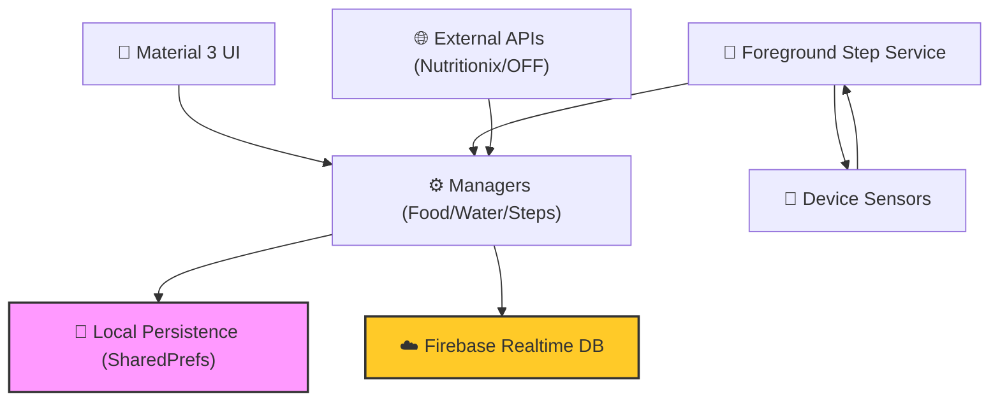

# FitSathi 🥗🏃‍♂️

[](https://developer.android.com/)
[](https://www.java.com/)
[](https://firebase.google.com/)
[](https://m3.material.io/)

> **"Your health is your greatest wealth. FitSathi is the companion that helps you manage it."**

**FitSathi** (Healthy Companion) is a comprehensive, privacy-focused fitness and nutrition tracking application for Android. It seamlessly combines real-time activity monitoring with deep nutritional insights and personalized workout plans to empower users on their health journey.


---

## ⚡ The Core Systems

FitSathi is built on four pillars of health, each managed by a dedicated intelligence module.

### 🏃‍♂️ 1. The Kinetic Engine (Activity Tracking)
The heart of FitSathi's physical monitoring.
- **Hardware Integration:** Utilizes device sensors (Step Counter/Detector) for high-precision tracking.
- **Foreground Reliability:** A dedicated Android Foreground Service ensures steps are counted even when the app is in the background.
- **Live Metrics:** Real-time calculation of Calories (Kcal) and Distance (km) using personalized biometric data.
- **Goal Rituals:** Interactive circular progress dashboards with **Konfetti** celebrations upon reaching daily milestones.

### 🥗 2. The Macro Intelligence (Nutrition)
A deep-dive into your daily fuel.
- **Dual-API Synergy:** Integrated with **Nutritionix** and **Open Food Facts** for a global food database.
- **Barcode Sovereignty:** Instant nutritional lookup via ML Kit-powered barcode scanning.
- **Precision Logging:** Track Calories, Carbs, Protein, Fat, Fiber, and Sugar across categorized meals (Breakfast, Lunch, Dinner, Snacks).
- **History Navigation:** Seamlessly browse historical nutrition logs to identify long-term trends.

### 🏋️‍♂️ 3. The Adaptive Coach (Workouts)
Personalized physical evolution.
- **Dynamic Generation:** Daily workouts generated based on your fitness goals (Weight Loss, Muscle Gain, etc.).
- **Context-Aware:** Exercises filtered by location (Home/Gym) and experience level (Beginner to Advanced).
- **Visual Library:** A library of 150+ exercises with high-quality visual guides and precise set/rep instructions.

### 💧 4. The Vitality Tracker (Hydration)
Managing the most critical element.
- **Atomic Persistence:** Dedicated water intake tracker with persistent daily logs.
- **Hydration Rituals:** Customizable daily water goals with quick-add functionality.
- **Smart Reminders:** Integrated notification system to ensure you stay hydrated throughout the day.

---

## 🏗️ Technical Architecture

FitSathi follows a robust, modular architecture designed for performance and reliability.



---

## 🛡️ Security & Privacy

Privacy is not an afterthought; it is baked into the "System."

- **Credential Masking:** API keys and sensitive identifiers are secured via `local.properties` and injected through `BuildConfig`, ensuring they never touch the public repository.
- **Secure Persistence:** Uses hardware-backed configuration management for sensitive user state.
- **Data Integrity:** Strict `.gitignore` protocols protect `google-services.json` and other private configuration files.
- **Local-First Processing:** Core tracking and calculation logic happen on-device, minimizing data exposure.

---

## 🌍 Localization

FitSathi is designed for a global audience with full support for:
- 🇺🇸 **English** (Standard)
- 🇮🇳 **Hindi** (Regional)
- 🇫🇷 **French** (International)

---

## 🛠️ Tech Stack

- **Core:** Java / Android SDK
- **Backend:** Firebase (Auth, Realtime Database, Storage)
- **Networking:** OkHttp, Volley
- **Analytics:** MPAndroidChart
- **Vision:** ML Kit (Barcode Scanning)
- **UI Ceremonies:** Konfetti, CircularProgressBar, Glide
- **Reliability:** Android Foreground Services, WorkManager, AlarmManager

---

## 🚀 Getting Started

### Prerequisites
- Android Studio Hedgehog (or newer)
- A Nutritionix API ID and Key
- A Firebase Project (with `google-services.json`)

### Setup
1. **Clone the repository:**
   ```bash
   git clone https://github.com/pranavbairollu/FitSathi.git
   ```
2. **Configure API Keys:**
   Open `local.properties` and add:
   ```properties
   nutritionix.app.id=YOUR_APP_ID
   nutritionix.app.key=YOUR_APP_KEY
   ```
3. **Add Firebase:**
   Place your `google-services.json` in the `app/` directory.
4. **Sync & Run:**
   Sync with Gradle and deploy to a physical device for best performance (especially for step tracking).

---

<p align="center">
  <b>Developed by Pranav Bairollu</b><br>
  <i>"FitSathi: Your Journey, Simplified."</i><br>
  <a href="mailto:pranavbairollu@gmail.com">Contact Developer</a>
</p>
