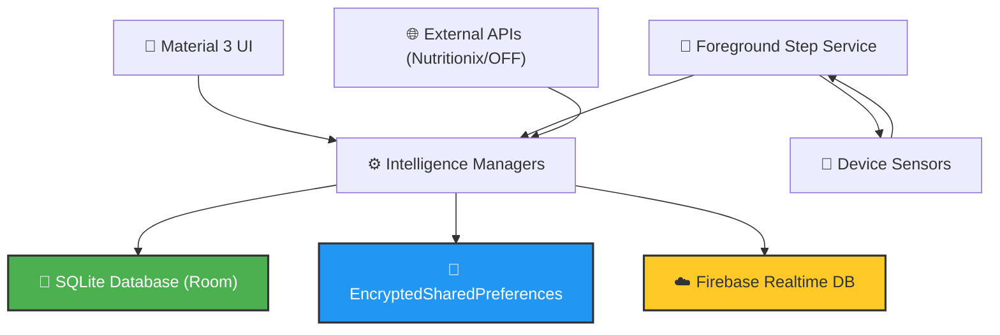

# FitSathi 🥗🏃‍♂️

> **"Your health is your greatest wealth. FitSathi is the companion that helps you manage it."**

**FitSathi** (Healthy Companion) is a comprehensive, privacy-focused fitness and nutrition tracking application for Android. It combines high-precision activity monitoring with deep nutritional insights and personalized workout plans, all backed by a robust, secure offline-first architecture.

  

---

## ⚡ The Core Systems

FitSathi is built on four pillars of health, each powered by dedicated intelligence modules and persistent data layers.

### 🏃‍♂️ 1. The Kinetic Engine (Activity Tracking)
- **High-Precision Monitoring:** Direct integration with hardware sensors (Step Counter/Detector).
- **Infinite Tracking:** A hardened **Android Foreground Service** ensures steps are logged accurately even under system pressure or background execution.
- **Biometric Analytics:** Real-time calculation of Kcal and Distance tailored to user-specific biometrics.
- **Goal Rituals:** Interactive Circular Progress Dashboards with dynamic **Konfetti** celebrations.

### 🥗 2. The Macro Intelligence (Nutrition)
- **Dual-API Ecosystem:** Synergetic integration with **Nutritionix** and **Open Food Facts**.
- **Vision Intelligence:** Instant nutritional lookup via **Google ML Kit** powered barcode scanning.
- **Deep Logging:** Detailed tracking of Calories, Macros (Carbs, Protein, Fat), and Micros (Fiber, Sugar).
- **Historical Insights:** Navigate through daily logs to visualize long-term nutritional trends.

### 🏋️‍♂️ 3. The Adaptive Coach (Workouts)
- **Personalized Evolution:** Dynamic workout generation based on fitness goals (Weight Loss, Muscle Gain, Maintenance).
- **Contextual Awareness:** Smart filtering for location (Home/Gym) and intensity levels.
- **Visual Library:** 150+ exercises with high-fidelity visual guides and precise instruction sets.

### 💧 4. The Vitality Tracker (Hydration)
- **Atomic Persistence:** Reliable water intake tracking with immediate persistence.
- **Hydration Rituals:** Customizable daily goals with quick-action logging.
- **Smart Reminders:** Intelligent notification system to maintain optimal hydration levels.

---

## 🏗️ Technical Architecture

FitSathi utilizes a modern, modular architecture that prioritizes data integrity and system responsiveness.

---

## 🛡️ Security & Privacy (The "Hardened" Standard)

Data privacy is the foundation of FitSathi. The application implements industry-standard security protocols:

- **AES-256 Encryption:** All sensitive user preferences and biometrics are stored using **Jetpack Security (EncryptedSharedPreferences)**, backed by hardware-level keystores.
- **SQLite Persistence:** Historical logs migrated from legacy storage to **Room Database** for ACID compliance and performance.
- **Credential Masking:** API keys are never hardcoded; they are injected via `local.properties` and `BuildConfig`.
- **Atomic Reset:** A "Global Reset" mechanism ensures 100% data purgation upon user request, maintaining absolute privacy sovereignty.

---

## 🌍 Localization

FitSathi supports a global user base with seamless language switching:
- 🇺🇸 **English** (Standard)
- 🇮🇳 **Hindi** (Regional)
- 🇫🇷 **French** (International)

---

## 🛠️ Tech Stack

- **Language:** Java (Modern SDK 34+)
- **Database:** Room (SQLite)
- **Security:** Jetpack Security (Crypto)
- **Cloud:** Firebase (Auth, Realtime DB)
- **Networking:** OkHttp, Volley
- **UI/UX:** Material 3, MPAndroidChart, Glide, Konfetti
- **Vision:** Google ML Kit
- **Core:** Android Foreground Services, WorkManager, AlarmManager

---

## 🚀 Getting Started

### Prerequisites
- Android Studio Hedgehog (or newer)
- Nutritionix API Credentials
- Firebase `google-services.json`

### Setup
1. **Clone:** `git clone https://github.com/pranavbairollu/FitSathi.git`
2. **Configure Security:** Add `nutritionix.app.id` and `nutritionix.app.key` to `local.properties`.
3. **Add Firebase:** Place `google-services.json` in the `app/` folder.
4. **Deploy:** Sync Gradle and run on a physical device for full sensor support.

---

  <b>Developed by Pranav Bairollu</b> 
  <i>"FitSathi: Your Health, Hardened."</i> 
  <a href="mailto:pranavbairollu@gmail.com">Contact Developer</a>

